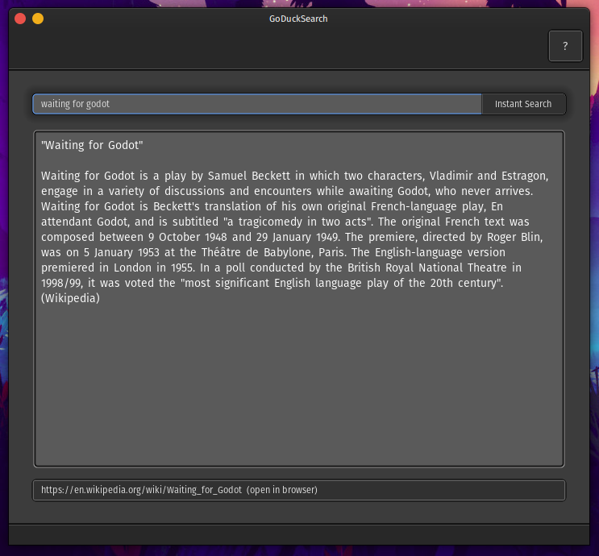
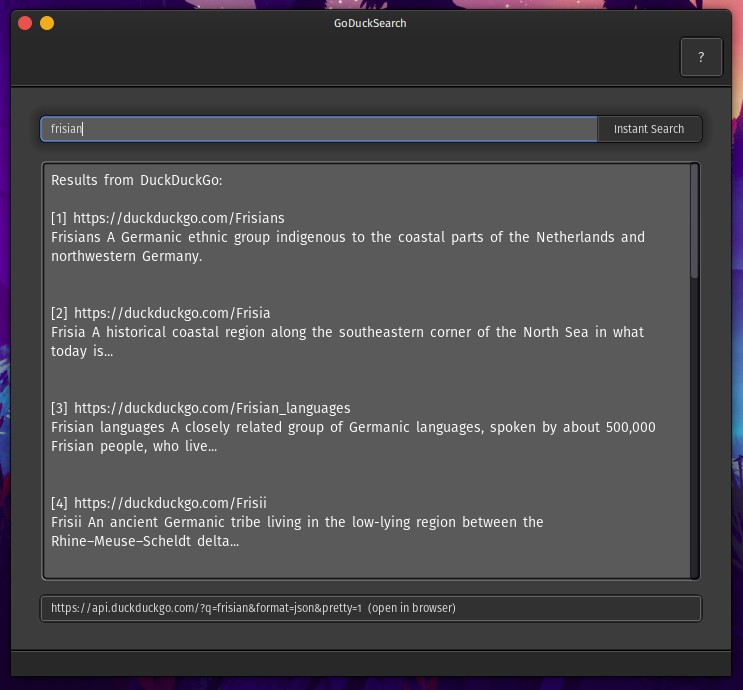

# GoDuck
Quick and basic implementation of [DuckDuckGo *Instant Search* API](https://duckduckgo.com/api) using Godot Engine and GDScript. This does not use the full search result from DuckDuckGo. In an okay-ish state at the moment.

## Open in Godot
Using Godot Engine version 3.2.3 stable official (Steam). May work using other Godot versions.

* Open Godot project manager
* Import
* Load the `project.godot` file in the `goducksearch` folder

## Screenshots
### Wikipedia summary

### DuckDuckGo search result

## Downloads
* [Linux x86_64](https://github.com/waimus/GoDuck/releases/download/v2.1.0/goduck-2.1-29_march_2021-linux_x86-64.zip)
* [Windows](https://github.com/waimus/GoDuck/releases/download/v2.1.0/goduck-2.1-29_march_2021-windows.zip)

Check out the [release page](https://github.com/waimus/GoDuck/releases).

## Usage Guide
Type any keyword on the search bar and press enter or by clicking the "instant search" button. GoDuck allows several commands which started with prefix `!`, those are:
* `!related`: Some search result may directly show a Wikipedia summary. Use `!related` next to your keyword to show DuckDuckGo results instead.
* `!clear`: Clear the content text.
* `!quit` and `!exit`: Quit GoDuck.

## License
* This project is licensed under the [MIT license](https://github.com/waimus/GoDuck/blob/main/LICENSE).
* This project uses Fira Sans Book font ([SIL OPEN FONT LICENSE Version 1.1](https://github.com/bBoxType/FiraSans/blob/master/OFL.txt))
* This project may show Wikipedia content ([CC BY-SA 3.0](https://en.wikipedia.org/wiki/Wikipedia:Text_of_Creative_Commons_Attribution-ShareAlike_3.0_Unported_License))
* This project uses [DuckDuckGo Instant Answer API](https://duckduckgo.com/api)