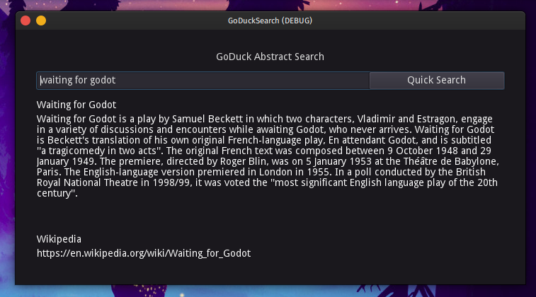

# GoDuck
Ridiculously quick and basic implementation of DuckDuckGo *summary* search API using Godot Engine and GDScript. In a very messy state at the moment.

## Open in Godot
Using Godot Engine version 3.2.3 stable official (Steam). May work using other Godot versions.

* Open Godot project manager
* Import
* Load the `project.godot` file in the `goducksearch` folder

## Screenshots

## Downloads

* [Linux x86_64](https://github.com/waimus/GoDuck/releases/download/v1.0.0/goduck-28_march_2021-linux_x86-64.zip)
* [Windows](https://github.com/waimus/GoDuck/releases/download/v1.0.0/goduck-28_march_2021-windows.zip)

Check out the [release page](https://github.com/waimus/GoDuck/releases).

## License

This project is licensed under the [MIT license](https://github.com/waimus/GoDuck/blob/main/LICENSE).